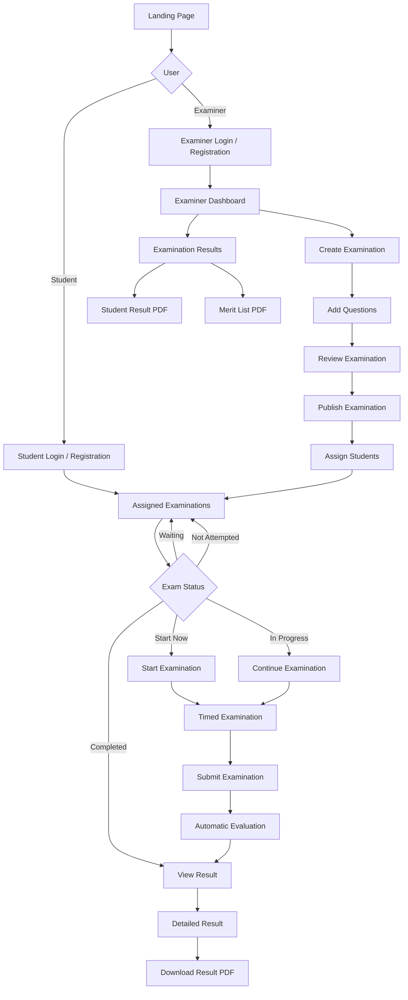
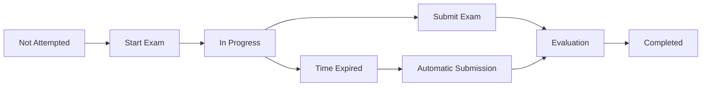
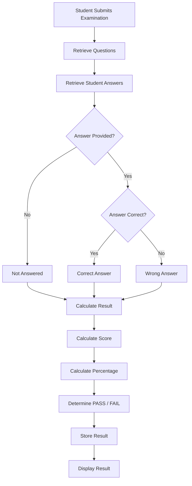
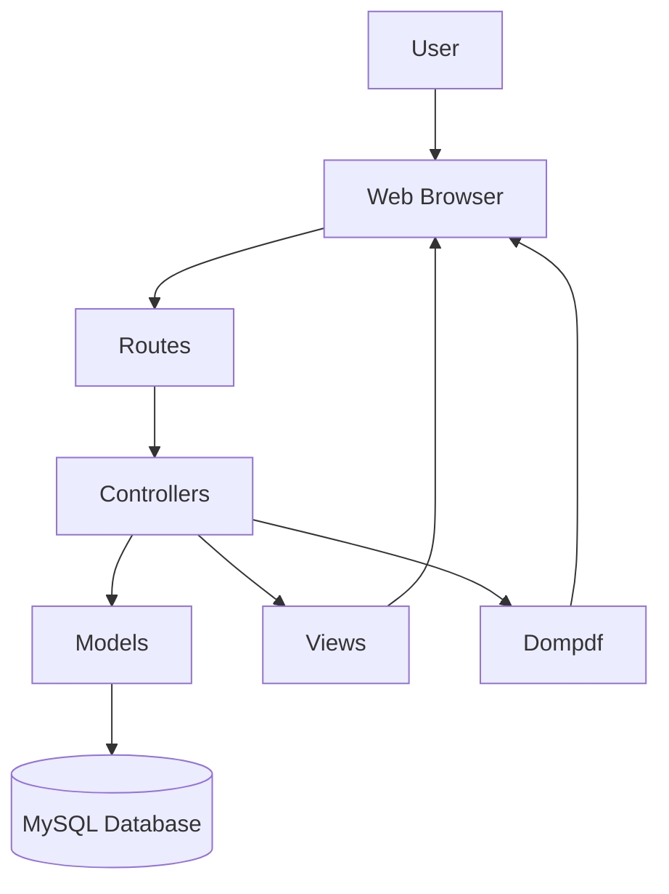
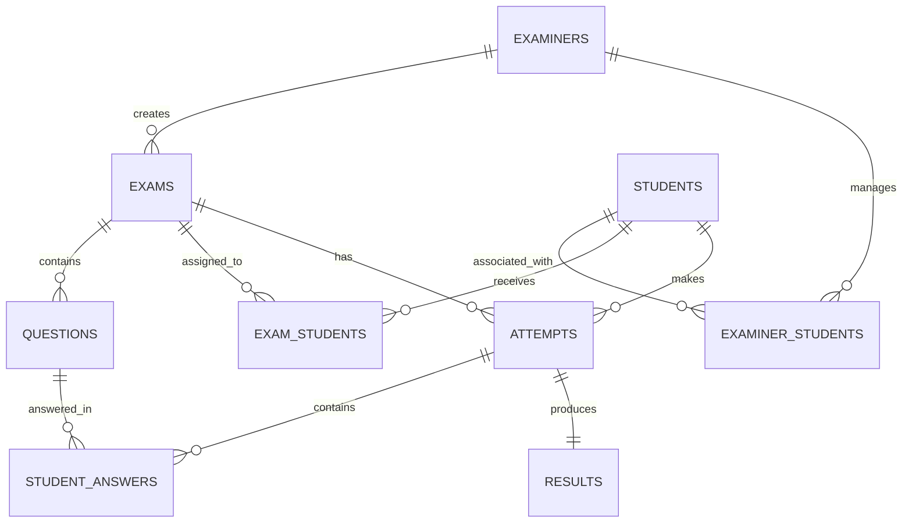

# EduQuiz

> Online Examination & Automated Result Management System

EduQuiz is a web-based online examination system developed using **CodeIgniter 4, PHP, MySQL, Bootstrap 5, and JavaScript**.

The system allows examiners to create and manage examinations, add questions, assign examinations to students, conduct timed examinations, automatically evaluate answers, and generate results and merit lists.

---

## 📌 Introduction

EduQuiz provides a complete digital examination workflow for **Examiners** and **Students**.

Examiners can create examinations, add questions, review and publish examinations, assign them to students, monitor submissions, view results, and generate PDF reports.

Students can view their assigned examinations, attempt available examinations within the given time, continue an active examination, submit their answers, and view automatically generated results.

---

## 🚀 Features

### Examiner Features

- Examiner registration and login
- Examiner dashboard
- Create examinations
- Edit examinations
- Delete examinations
- Add examination questions
- Edit questions
- Delete questions
- Review examinations before publishing
- Publish/finish examinations
- Manage students
- Assign examinations to students
- View examination submissions
- View student results
- Download individual student result PDF
- Download examination merit list PDF

### Student Features

- Student registration and login
- View assigned examinations
- View examination status
- Start available examinations
- Continue an active examination
- Timed examinations
- Submit examinations
- Automatic evaluation
- View detailed examination results
- View correct and wrong answers
- View unanswered questions
- Download result PDF
- Manage student profile

---

## 👥 User Roles

### 👨‍🏫 Examiner

The Examiner manages examinations and students.

```text
Login
   ↓
Dashboard
   ↓
Create Examination
   ↓
Add Questions
   ↓
Review Examination
   ↓
Publish Examination
   ↓
Assign Students
   ↓
Monitor Submissions
   ↓
View Results
   ↓
Download Reports
```

### 👨‍🎓 Student

The Student attempts examinations assigned by an examiner.

```text
Login
   ↓
Assigned Examinations
   ↓
Check Exam Status
   ↓
Start / Continue Exam
   ↓
Attempt Questions
   ↓
Submit / Time Expired
   ↓
Automatic Evaluation
   ↓
View Result
   ↓
Download Result PDF
```

---

## 🧩 Main Modules

| Module | Description |
|---|---|
| Authentication | Examiner and student registration, login and logout |
| Examiner Management | Examiner dashboard and examination management |
| Examination Management | Create, edit, review, publish and manage examinations |
| Question Management | Add, edit and delete examination questions |
| Student Management | Manage students associated with examiners |
| Exam Assignment | Assign examinations to selected students |
| Online Examination | Conduct timed examinations |
| Evaluation | Automatically evaluate submitted answers |
| Result Management | Generate and display examination results |
| PDF Reporting | Generate result and merit list PDFs |

---

## 🔄 Application Flow



---

## ⏱️ Examination Flow

Each student can attempt a particular examination **only once**.

If a student starts an examination but has not submitted it, the student can continue the same active attempt.

After submission or time expiration, another attempt is not allowed.



---

## 📊 Examination Status

Students can see the following examination statuses:

| Status | Description |
|---|---|
| Waiting | Examination is not available yet |
| Start Now | Examination is currently available |
| In Progress | Student has started but not submitted the examination |
| Completed | Student has submitted the examination |
| Not Attempted | Examination deadline has passed without an attempt |

---

## 📊 Result Processing

After a student submits an examination, the system automatically evaluates the submitted answers.



### Result Contains

- Total questions
- Answered questions
- Correct answers
- Wrong answers
- Unanswered questions
- Total score
- Percentage
- PASS / FAIL status

---

## 🏗️ System Architecture

EduQuiz follows the **MVC (Model-View-Controller)** architecture provided by CodeIgniter 4.



### Architecture Components

**Routes**  
Handle incoming requests and map them to controllers.

**Controllers**  
Handle application logic and coordinate between models and views.

**Models**  
Handle database operations.

**Views**  
Provide the user interface.

**Dompdf**  
Generates downloadable PDF reports.

---

## 🗄️ Database Structure

The main database entities are:

```text
Examiner
   │
   ├── Examinations
   │       │
   │       └── Questions
   │
   └── Examiner Students
             │
             └── Students
                    │
                    └── Exam Assignments
                           │
                           └── Attempts
                                  │
                                  ├── Student Answers
                                  │
                                  └── Results
```

### Database Relationships



### Main Tables

- `examiners`
- `students`
- `exams`
- `questions`
- `examiner_students`
- `exam_students`
- `attempts`
- `student_answers`
- `results`

---

## 🛠️ Technology Stack

### Backend

- PHP
- CodeIgniter 4

### Frontend

- HTML5
- CSS3
- JavaScript
- Bootstrap 5
- Bootstrap Icons

### Database

- MySQL 8.0

### PDF Generation

- Dompdf

### Development Environment

- XAMPP
- Composer

---

## 📁 Project Structure

```text
EduQuiz/
│
├── app/
│   ├── Config/
│   │   └── Routes.php
│   │
│   ├── Controllers/
│   │   ├── DashboardController.php
│   │   ├── ExamController.php
│   │   ├── QuestionController.php
│   │   ├── StudentController.php
│   │   └── StudentExamController.php
│   │
│   ├── Models/
│   │   ├── ExamModel.php
│   │   ├── QuestionModel.php
│   │   ├── StudentModel.php
│   │   ├── AttemptModel.php
│   │   ├── StudentAnswerModel.php
│   │   ├── ResultModel.php
│   │   ├── ExamStudentModel.php
│   │   └── ExaminerStudentModel.php
│   │
│   └── Views/
│       ├── exams/
│       ├── questions/
│       ├── student_exam/
│       └── ...
│
├── public/
├── writable/
├── vendor/
├── .env
├── composer.json
└── README.md
```

---

## ⚙️ Installation & Setup

### Prerequisites

Make sure the following are installed:

- PHP
- Composer
- MySQL 8.0
- XAMPP
- Git
- Web Browser

### 1. Clone the Repository

```bash
git clone <repository-url>
cd EduQuiz
```

### 2. Install Dependencies

```bash
composer install
```

### 3. Configure Environment

Create the `.env` file from the provided environment configuration.

```bash
cp env .env
```

Configure the database:

```env
database.default.hostname = localhost
database.default.database = eduquiz
database.default.username = root
database.default.password =
database.default.DBDriver = MySQLi
database.default.port = 3306
```

### 4. Create Database

Create a MySQL database:

```text
eduquiz
```

Import the project database schema.

### 5. Start the Application

```bash
php spark serve
```

Open the application in your browser:

```text
http://localhost:8080
```

---

## 📄 PDF Reports

EduQuiz uses **Dompdf** for generating PDF reports.

### Available Reports

- Student Result PDF
- Individual Student Result PDF for Examiner
- Examination Merit List PDF

---

## 🔐 Security

The application uses authentication and authorization to separate examiner and student functionality.

Important security practices for deployment include:

- Password hashing
- Session-based authentication
- Server-side validation
- Authorization checks
- Database security
- Protected environment configuration
- HTTPS in production

> **Note:** Any plaintext password storage used during development or demonstration should be replaced with secure password hashing before production deployment.

---

## 🔮 Future Enhancements

Possible future improvements include:

- Email notifications
- CSV/Excel question import
- Question bank management
- Randomized questions
- Randomized answer options
- Subjective/descriptive questions
- Advanced student performance analytics
- Password reset
- Two-factor authentication
- Anti-cheating mechanisms
- REST API
- Cloud deployment
- Admin panel
- Certificate generation

---

## 📌 Project Status

**Completed – Core Version**

The core EduQuiz examination workflow has been implemented.

### Completed Features

- Examiner authentication
- Student authentication
- Examiner dashboard
- Examination management
- Question management
- Student management
- Examination assignment
- Timed examinations
- Single-attempt examination rule
- Automatic evaluation
- Detailed result management
- Correct/wrong answer display
- Student result PDF
- Individual student result PDF
- Examination merit list PDF
- Student profile management
- Responsive Bootstrap-based interface

---

## 👨‍💻 Developer

### Ishwar Bachhav

**MCA Student | Software Developer**

Interested in:

- Java Development
- Web Development
- Backend Development
- Database Systems
- Software Engineering

### Technologies

`Java` `PHP` `CodeIgniter 4` `MySQL` `JavaScript` `Bootstrap` `Python`

---

## 📜 License
"- Ishwar Bachhav"
This project was developed for educational and academic purposes.

---
